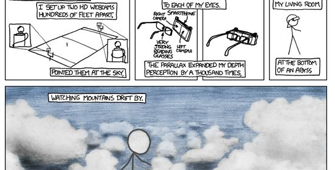
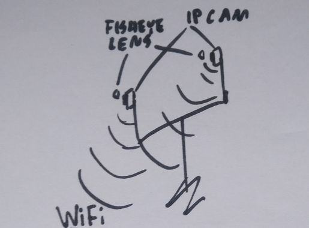

## Titan vision
Chcę to.

Wizjer pokazujący widok z osobnej kamerki na każde oko.

Niekoniecznie na szerokość boiska, ale pewnie fajnie będzie zezować z kilkumetrowym rozstawem oczu

## Jak?
Jakoś tak:

 
Stojak z **2 kamerami** łączonymi przez WiFi (by można było je stawiać nie zależnie od siebie). 
 
**Raspberry Pi** jako odbiornik. 
**Ekran AMOLED** przed soczewkami **VR gogli**.

Może dołoży się też na każdą kamerę **soczewkę fisheye** - zobaczy się jak to będzie wyglądać w goglach VR, to może się okazać dobrym pomysłem ze względu na charakter zniekształcenia obrazu...

### Dlaczego Raspberry Pi a nie telefon?
Nie chciałem walczyć z opcjami oszczędzania energii, etc. 
Ponadto z rpi można dodać do tego akcelerometr i kompas... 
... które w telefonie pewnie już są... 
... OK, to dlatego że mam fajny ekran OLED i chciałem go spróbować w VR.

