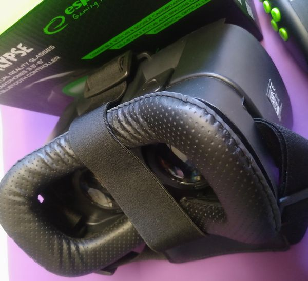
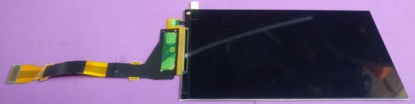
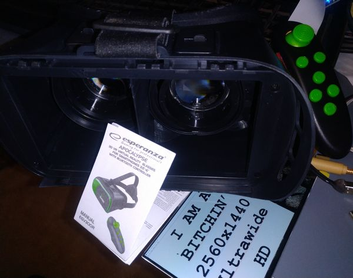
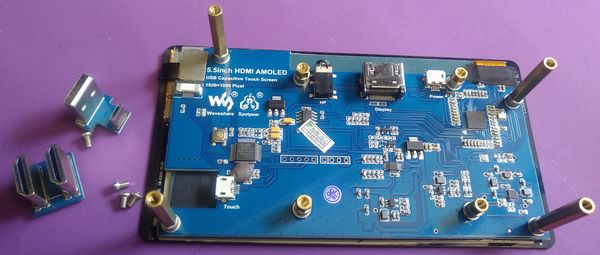
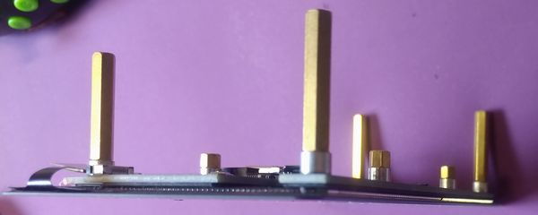
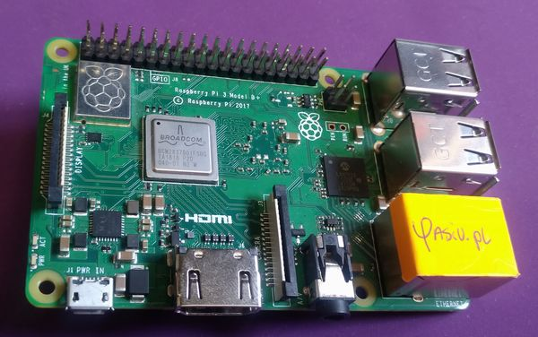
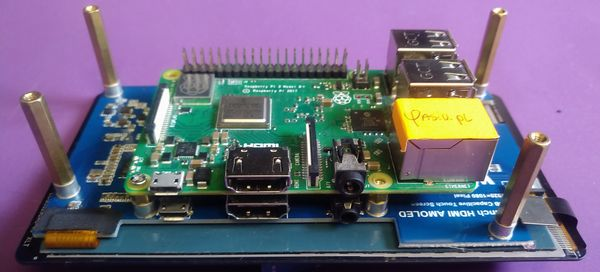

## Części

### VR Gogle

Tani zestaw Esperanza EGV300R 
Regulacja odstępu i rozstawu soczewek.

### Ekran
Wstępnie, miał być ten:
 
**2560x1440**, najlepsza rozdzielczość do czegoś takiego! Nie AMOLED, ale super cienkie, lekkie. 
Planowałem użyć Raspberry Pi Zero W i utrzymywać przód urządzenia tak lekki jak sięda, do swobodniejszego noszenia niż z telefonem. 
Wszystko było gotowe... 
 
... tylko sterownik ekranu nie działa z 50Hz (Raspberry Pi).

No, cóż... bywa. 
Mam za to jeszcze kupiony wcześniej [ekran **AMOLED**, specjalnie do Raspberry Pi](https://www.waveshare.com/5.5inch-hdmi-amoled.htm)! 
 
Co prawda jest grubszy od samego LCD... 
 
i do tego przeznaczony do przykręcenia pełnowymiarowego Raspberry Pi z tyłu (więc nici z superlekkości), to ma plus: AMOLED. Super jakość kolorów i naprawdę czarna czerń.

### Raspberry Pi
OK, mały problem: nie jestem właścicielem ani jednej pełnowymiarowej malinki. Same RPi0... 
Ale z pomocą przychodzi kolega [Marcin](https://yasiu.pl)

### Obudowa do Pi
Malinka z ekranem zespajają się w taki sposób:
 
... ale sądzę że trochę osłony będzie zdrowe. 
Zwykła, plastikowa obudowa, tylko do przerobienia by nowe gniazda mogły wejść.

