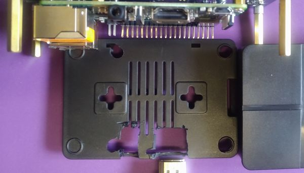
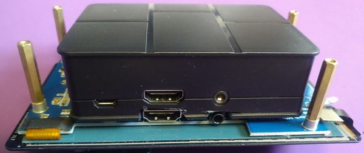

## Składanie

### Obudowa na Pi

 
Trochę tylko obcięty plastik by się wpasowało w wolne miejsce... 
 
I mamy pięknie zamontowaną obudowę na malinkę :) 
Przynajmniej nie grozi nam wygięcie pinów. 
 

Po nałożeniu na gogle 
 
Leży jak ulał, ale jeszcze nie wiem czym to tam umocować.

### ciąg dalszy nastąpi...