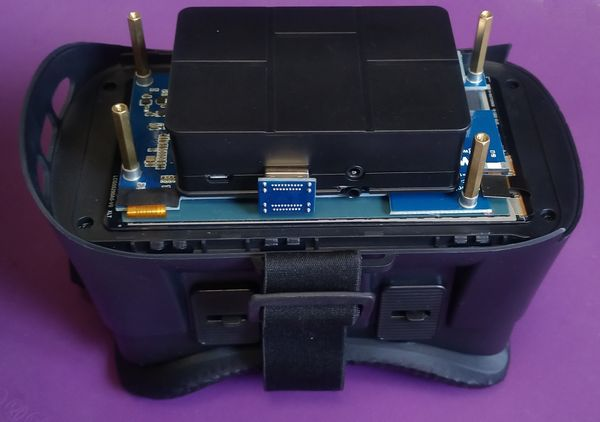
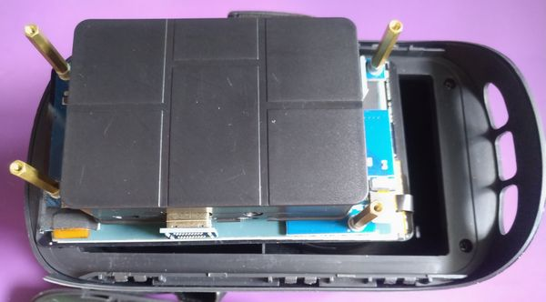
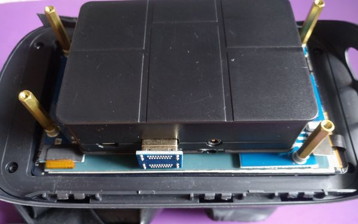
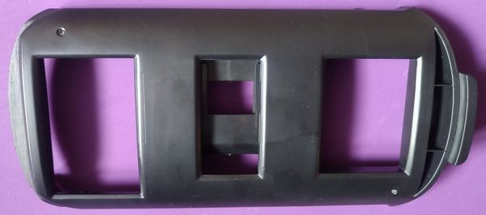
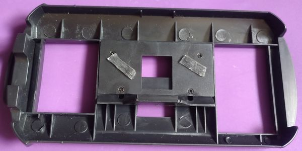
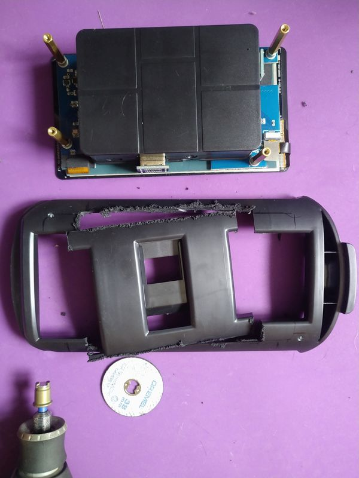
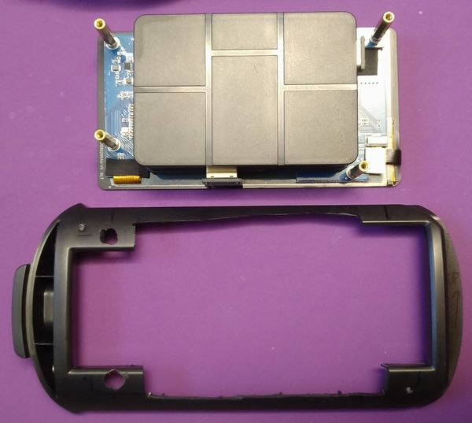
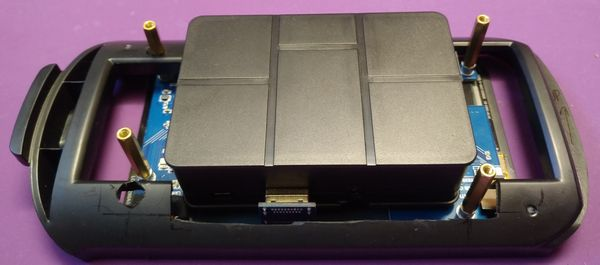

## Gogle + ekran
Ekran prawie idealnie pasuje do dziury w goglach: 
 
To NIE jest dobre. 
 
Ciężej w ten sposób wygodnie je zmontować (gdy nie ma dobrego oparcia), no i do tego będą prześwity... 
 
Ale poradzimy sobie.

### "Szufladka" na telefon
Gogle przyszły z czymś takim: 
 
 
W to się wkłada telefon i wsuwa w gogle.

Więc, oczywiście, pociąć to w diabły :) 
 
... by zmieścić w tym Pi z obudową. 
 
 

Mamy więc 2 części które za nic do siebie nie pasują, a mają być scalone. 
Myślę że pora na (zabarwiony na czarno) PCL :) 
