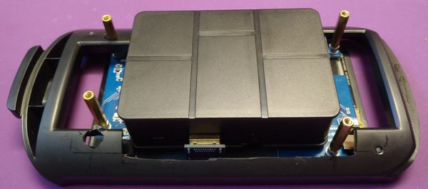

## Szufladka + ekran

 
To są2 części któe się nie trzymają siebie nawzajem, a powinny.
Na ratunek: PCL (Polymorph) zabarwiony na czarno!

Nie chcemy jednak trwale skleić ekranu - nie gdy możemy użyć śrub. 
Szufladka będzie trzymać podkładki, a ekran będzie do nich przykręcany śrubami. 
Wpierw przygotować wszystko, i odizolować folią PCL od elektroniki: 
 
I tak przy każdej śrubie: 
 

## Ciąg dalszy nastąpi...
