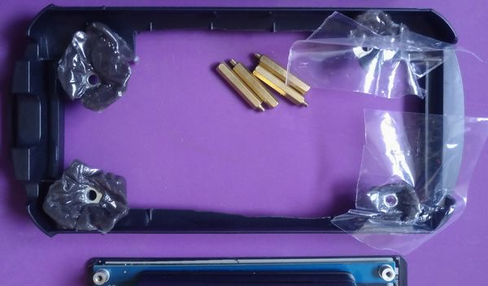

## Szufladka + ekran

<br>
To są2 części któe się nie trzymają siebie nawzajem, a powinny.
Na ratunek: PCL (Polymorph) zabarwiony na czarno!

Nie chcemy jednak trwale skleić ekranu - nie gdy możemy użyć śrub.<br>
Szufladka będzie trzymać podkładki, a ekran będzie do nich przykręcany śrubami.<br>
Wpierw przygotować wszystko, i odizolować folią PCL od elektroniki:<br>
<br>
I tak przy każdej śrubie:<br>
<br>


Odkształcone od folii, ale ma z grubsza poprawny kształt...<br>
<br>
<br>
... i pasuje do śrub.
<br>

Ekran jest dobrze trzymany w szufladce, pasuje do dziury w goglach idealnie (z minimalnym tylko odstępem),<br>
a sama szufladka swobodnie się przesuwa:
<br>
<br>
PCL zespaja podkładki z resztą szufladki, i utrzymuje odstęp od elektroniki:
<br>

No, ale choć przesuwa sięswobodnie, szufladka nie trzyma się reszty gogli bez części je domykającej<br>
- a ta została zdjęta by zmieścić Raspberry Pi.

Ale nie problem, mamy więcej PCL :)<br>
Njpierw nawiercić tam gdzie chcemy coś trzymać...<br>
<br>
NałożyćPCL i przecisnąć trochę przez dziurkę..<br>
<br>
... i uformować uchwyt pod którym szufladka może się ślizgać :)<br>
<br>
Podobnie na drugim kńcu:<br>
<br>
<br>
I gotowe :)<br>
<br>
Całość szugladki siętrzyma mocno, a jednocześnie może byćłatwo wyjęta i rozkręcona na części.<br>
<br>


## Oprogramowanie
Do tego celu bierzemy świeżuteńką nową kartę pamięci kompatybilną z Raspberry Pi:<br>
<br>

Ściągamy obraz [systemu operacyjnego - Raspbian, czy - obecnie - Raspberry Pi OS](https://www.raspberrypi.org/downloads/raspberry-pi-os/)

Nie używam "Raspberry Pi Imager", zwykła komenda dd wystarcza:
```
sudo dd bs=4M if=2020-05-27-raspios-buster-armhf.img  of=/dev/sdb conv=fsync
```
I pozostaje czekać.

<br>