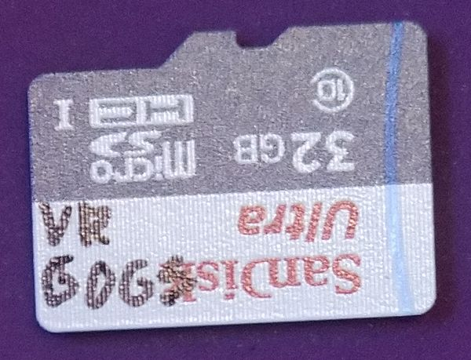

## System operacyjny

 

Tu planowałem opisać:
* raspi-config, i przydzielanie więcej pamięci do grafiki
* pierwsze próby z odpalaniem omxplayera do odtwarzania strumienia wideo z kamerki
* 2 instancje omxplayera na różnych miejscach ekranu, i widok z 2 kamerek
* obietnicę zautomatyzowania tego skryptem uruchamianym przyciskiem

Niestety, ekran...

 

... ten fajny OLED...

... jest trwale uszkodzony. Kaput. 💀
Nie uruchamia się, po małym nadłamaniu krawędzi.

⚰️