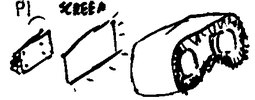
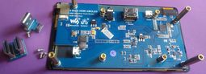
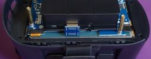
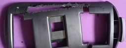
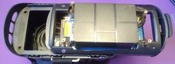
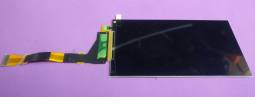

# amoled_vr_gogs

## Opis szczegółowy:

### [Wstęp](01_intro.md)

### [Części](02_parts.md)

### [Obudowa Pi](03_pi_case.md)

### [Gogle + ekran](04_join.md)

### [Szufladka + ekran](05_join2.md)

### [System operacyjny](06_os.md)

### [Zmiana ekranu](07_otherscreen.md)

